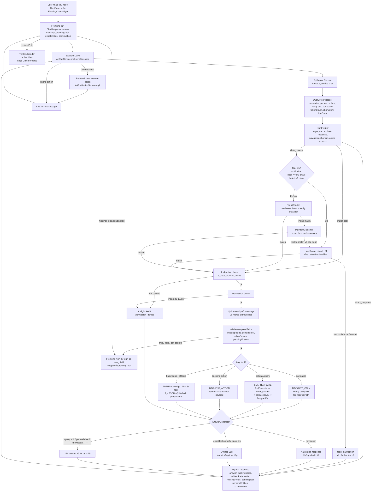

# Sơ Đồ Và Bóc Tách Chatbot AI Hiện Tại

Tài liệu này mô tả đúng luồng xử lý hiện tại của chatbot trong repo FAMS, dựa trên implementation ở:

- `ai-service/app/services/chat/services/chatbot_service.py`
- `ai-service/app/services/chat/router/*`
- `ai-service/app/services/chat/tools/executor.py`
- `ai-service/app/services/chat/services/answer_generator.py`
- `ai-service/app/services/chat/services/fptu_knowledge.py`
- `backend/src/main/java/com/fams/backend/service/impl/AIChatServiceImpl.java`
- `backend/src/main/java/com/fams/backend/service/impl/AIChatActionServiceImpl.java`
- `frontend/src/services/api/chatService.ts`
- `frontend/src/pages/chatbot/ChatPage.tsx`
- `frontend/src/components/common/FloatingChatWidget.tsx`

Tài liệu ưu tiên mô tả "hệ thống đang chạy như thế nào" thay vì kiến trúc lý tưởng hóa.

## 1. Sơ đồ tổng luồng chatbot

## 2. Bức tranh lớn: ai làm gì

### Frontend

- `ChatPage.tsx` và `FloatingChatWidget.tsx` là nơi user nhập câu hỏi.
- Frontend gọi `chatService.sendMessage(...)`.
- Request có thể mang theo:
  - `message`
  - `extraEntities`
  - `pendingTool`
  - `originalMessage`
  - `pendingEntities`
  - `continuation`
- Frontend không tự hiểu intent. Nó chỉ hiển thị:
  - `answer`
  - `thinkingSteps`
  - `redirectPath`
  - form nhập thêm dữ liệu khi có `missingFields`

### Backend Java

- `AIChatServiceImpl.sendMessage(...)` là cầu nối giữa UI và Python AI service.
- Backend:
  - lưu user message vào bảng chat
  - gom lịch sử chat gần nhất
  - gọi Python `/api/chat/full-flow`
  - nếu Python trả `action`, backend sẽ gọi `AIChatActionServiceImpl.handleAction(...)`
  - lưu assistant message và `redirectPath`

### Python AI service

- `chatbot_service.py` là orchestration layer chính.
- Đây là nơi:
  - normalize câu hỏi
  - chọn router
  - validate quyền và field bắt buộc
  - gọi tool
  - quyết định khi nào dùng LLM và khi nào không
  - trả payload chuẩn cho frontend/backend

## 3. Stage 1: nhập câu hỏi và tiền xử lý

File chính: `ai-service/app/services/chat/router/query_preprocessor.py`

### Hệ thống làm gì ở bước này

- Chuẩn hóa khoảng trắng.
- Chuẩn hóa dấu nháy thông minh.
- Thay một số phrase domain-specific:
  - `hoc ky doanh nghiep` -> `ojt`
  - `safe exam browser` -> `seb`
  - `truong dai hoc fpt` -> `fptu`
  - `hoc phi` -> `học phí`
- Chạy fuzzy typo correction theo vocabulary domain.
- Tạo metadata:
  - `message`
  - `tokenCount`
  - `ascii`
  - `corrections`
  - `changed`

### Ý nghĩa thực tế

- Đây là bước "kiểm tra chính tả nhẹ", nhưng không phải spell-check tổng quát kiểu Word/Google Docs.
- Nó chủ yếu sửa lỗi trong phạm vi từ vựng mà chatbot hiểu.
- Ví dụ:
  - dính từ như `thoikhoabieu` có thể bị tách về `thoi khoa bieu`
  - typo gần giống domain token có thể được sửa

## 4. Stage 2: Hard Router bắt nhanh các case chắc chắn

File chính: `ai-service/app/services/chat/router/hard_router.py`

### Hard Router dùng để làm gì

Đây là lớp routing nhanh, ưu tiên:

- `direct_response`
  - chào hỏi
  - cảm ơn
  - hỏi chatbot là ai
- `navigation` regex
  - `mở trang sinh viên`
  - `mở màn hình môn học`
- shortcut action/query
  - tạo group chat
  - tạo thông báo
  - một số truy vấn attendance hoặc major rõ ràng
- semantic fallback cho navigation

### Tại sao cần Hard Router

- Nhanh hơn gọi LLM.
- Ổn định cho các lệnh UI đơn giản.
- Giảm chi phí và độ trễ.

### Kết quả có thể trả ra ngay

- `direct_response`: trả text trực tiếp, kết thúc luồng.
- `navigation`: đi thẳng xuống nhánh redirect, thường không cần LLM.
- `action` hoặc `data_query`: đi tiếp sang validation/executor.

## 5. Stage 3: câu ngắn, câu dài, Trend Router, ML Router, LLM Router

File chính:

- `chatbot_service.py`
- `trend_router.py`
- `ml_intent_classifier.py`
- `light_router.py`

### 5.1. Cách hệ thống phân biệt câu dài

Trong `chatbot_service.py`, hàm `_should_use_llm_router(...)` ưu tiên LLM router nếu:

- `tokenCount >= 32`
- hoặc `len(raw_message) >= 240`
- hoặc `line_count >= 3`

### 5.2. Câu ngắn đi như thế nào

Nếu Hard Router không match và câu chưa vượt ngưỡng dài:

1. `TrendRouter` chạy trước
2. nếu không khớp thì `MLIntentClassifier`
3. nếu vẫn không khớp mới fallback sang `LightRouter` dùng LLM

### 5.3. Câu dài đi như thế nào

Nếu câu dài:

1. ưu tiên `LightRouter` dùng LLM trước
2. nếu LLM router lỗi hoặc không ra kết quả đủ tốt thì mới rơi về fallback khác

### 5.4. Trend Router là gì

`TrendRouter` là rule-based router giàu ngữ nghĩa hơn Hard Router:

- dùng regex cho:
  - lịch học
  - điểm
  - điểm danh
  - thông báo
  - người dùng
  - lớp
  - ngành
  - chuyên ngành
  - phòng
- tự extract entity như:
  - `student_code`
  - `lecturer_code`
  - `class_name`
  - `course_code`
  - `semester_code`
  - `room_name`
  - `date`
  - `slot_number`

### 5.5. MLIntentClassifier là gì

`MLIntentClassifier` trong repo hiện tại không phải model ML nặng.

Nó hoạt động kiểu:

- normalize câu
- tokenize
- so overlap với `_TOOL_EXAMPLES`
- cộng thêm điểm boost theo entity
- chọn tool có score cao nhất nếu qua threshold

Nó giống một bộ classifier nhẹ theo heuristic hơn là một model học máy phức tạp.

### 5.6. LightRouter là gì

`LightRouter` là nơi dùng `LLM` để chọn:

- `intent`
- `toolName`
- `entities`
- đôi khi `agent`

Đây là lớp fallback thông minh khi rule-based không đủ chắc, hoặc khi câu hỏi dài/phức tạp.

## 6. Các trường hợp đặc biệt khi phân tích câu hỏi

### Câu hỏi quá dài

- Ưu tiên `LightRouter` ngay.
- Lý do: câu dài thường chứa nhiều điều kiện, nhiều entity, nhiều ngữ cảnh.

### Câu hỏi ngắn nhưng mơ hồ

Ví dụ:

- `điểm`
- `lịch`
- `chuyên ngành`

Hard Router có thể trả câu hỏi làm rõ ngay, thay vì đoán tool.

### Câu hỏi thiếu field bắt buộc

Ví dụ:

- hỏi lịch lớp nhưng không có `class_name`
- tạo thông báo nhưng thiếu `class_name` hoặc `content`
- tạo action nhưng còn thiếu field required

Hệ thống không chạy tool ngay. Nó trả:

- `missingFields`
- `pendingTool`
- `pendingEntities`
- `actionReview`

Frontend sẽ hiện form để user nhập tiếp.

### Tool bị khóa

Hệ thống check:

- `is_kept_tool(...)`
- `tools_loader.tool_status`
- `tools_loader.inactive_tools`

Nếu tool bị khóa hoặc bị admin tắt, chatbot trả `tool_locked`.

### User không đủ quyền

`check_permission(...)` chặn các tool không đúng role.

Ví dụ:

- student gọi action chỉ dành cho admin/academic staff
- lecturer gọi tool vượt quyền

Kết quả là `permission_denied`.

## 7. Sau khi có intent/tool: hệ thống còn kiểm tra gì

File chính: `chatbot_service.py`

Sau khi router chọn được tool, chatbot chưa chạy tool ngay. Nó còn các bước:

### Tool active check

- tool còn nằm trong core inventory không
- tool có đang active trong DB `ai_tools` không

### Permission check

- role hiện tại có được dùng tool đó không

### Hydrate entity

`_hydrate_entities_from_message(...)` sẽ bơm thêm entity từ message nếu router chưa extract đủ.

Ví dụ:

- suy ra `TODAY`, `TOMORROW`, `THIS_WEEK`, `NEXT_WEEK`
- bổ sung `slot_number` cho `get_empty_rooms`

### Validate required fields

Các helper như:

- `validate_required_entities(...)`
- `has_enough_required_entities(...)`
- `build_missing_fields(...)`
- `build_action_review_fields(...)`

được dùng để quyết định:

- đã đủ field để chạy chưa
- có cần hỏi thêm không
- có cần màn confirm trước khi chạy action không

## 8. Tool được chia thành mấy nhóm

File chính:

- `ai-service/app/services/chat/db/tools_loader.py`
- `ai-service/app/services/chat/tools/executor.py`

## 8.1. `NAVIGATE_ONLY`

### Bản chất

- Không query DB.
- Không tạo CRUD.
- Chỉ tạo `redirectPath`.

### Ví dụ

- `view_students`
- `view_courses`
- `view_rooms`
- `view_schedule`

### Khi nào không cần LLM

Nếu đã xác định được tool navigation, `AnswerGenerator` dùng `_navigation_response(...)` để trả câu kiểu:

- `Dạ, tôi đang mở ... cho bạn`

Tức là:

- không cần LLM viết câu trả lời
- frontend chỉ cần nhận `redirectPath` rồi mở link/trang tương ứng

## 8.2. `SQL_TEMPLATE`

### Bản chất

- Đây là nhánh truy vấn dữ liệu DB.
- `ToolExecutor.execute(...)` sẽ:
  - nhận `toolName`
  - normalize entity
  - build params
  - lấy SQL template từ `db/queries.py` hoặc fallback DB
  - query bằng `db_pool`

### Dùng cho gì

- danh sách sinh viên lớp
- lịch học
- phòng trống
- điểm danh
- bảng điểm
- thông tin user, lecturer, student

## 8.3. `BACKEND_ACTION`

### Bản chất

- Python không thực thi business action thật.
- `ToolExecutor` phát hiện tool nằm trong `tools_loader.backend_actions` thì `skip SQL` và trả `None`.
- Sau đó Python trả về `action` payload.
- Backend Java mới thực thi thật qua `AIChatActionServiceImpl`.

### Ví dụ action

- `CREATE_NOTIFICATION`
- `CREATE_USER`
- `UPDATE_USER`
- `CREATE_CLASS`
- `UPDATE_CLASS`
- `APPROVE_SCHEDULE_REQUEST`
- `REJECT_SCHEDULE_REQUEST`
- `UPDATE_ATTENDANCE_MANUALLY`

### Kết luận ngắn gọn

CRUD không chạy ở frontend, cũng không chạy ở LLM.

CRUD chạy ở backend Java.

Python chỉ:

- hiểu yêu cầu
- chọn action
- gom params
- yêu cầu backend thực hiện

## 8.4. `AI-only` và knowledge tools

### General chat

- `general_offtopic_chat`
- dùng LLM để trả lời câu hỏi ngoài lề hệ thống

### FPTU knowledge

- `fpt_tool`
- `fptu_knowledge_lookup`

Nhóm này không lấy từ DB, mà đọc file JSON nội bộ.

## 9. Tool nào đọc JSON chứ không lấy từ DB

File chính: `ai-service/app/services/chat/services/fptu_knowledge.py`

### Nguồn dữ liệu

- `fptu-information-Student.json`
- `fpt-information-Lecturer.json`

### Dùng cho câu hỏi nào

- FPTU
- OJT
- SEB
- học phí
- Global Program
- LMS
- profile sinh viên
- guideline, quy định, exam guide
- một phần tri thức giảng viên

### Cách hoạt động

- normalize text
- tokenize
- match theo hints/topic
- lấy context phù hợp từ JSON
- sau đó:
  - hoặc LLM diễn đạt lại từ context
  - hoặc trả câu "chưa có trong file tri thức"

### Kết luận

Đây chính là nhánh "tool đọc JSON chứ không phải lấy tài liệu trong DB".

## 10. `ToolExecutor` xử lý gì trước khi query

File chính: `ai-service/app/services/chat/tools/executor.py`

### Các việc executor làm

- merge `action.params` vào `entities`
- normalize entity
- auto convert vài case đặc biệt
  - `full_name` -> `lecturer_code`
  - `full_name` -> `student_code`
- xử lý pagination
- phân nhánh:
  - backend action -> skip SQL
  - navigate only -> skip SQL
  - dynamic SQL / excel query
  - SQL template bình thường

### Dynamic SQL

- chỉ cho phép SQL bắt đầu bằng `SELECT`
- nếu không phải `SELECT` thì reject

## 11. Câu trả lời được LLM tạo như thế nào

File chính:

- `answer_generator.py`
- `llm_client.py`

### 11.1. Không phải mọi câu trả lời đều qua LLM

`AnswerGenerator.generate(...)` có nhiều fast-path:

- `permission_denied` -> text cứng
- `tool_locked` -> text cứng
- `navigation` -> `_navigation_response(...)`
- `exact lookup` -> `_direct_table_response(...)`
- `data_query` có bảng lớn >= 10 dòng -> bypass LLM
- `knowledge/general chat` -> dùng LLM
- `data query nhỏ` -> có thể dùng LLM

### 11.2. Khi nào dùng LLM để trả lời

LLM được dùng chủ yếu trong 3 trường hợp:

1. `LightRouter` chọn intent/tool/entities
2. `AnswerGenerator` diễn đạt kết quả query nhỏ thành câu tiếng Việt tự nhiên
3. `general_chat` hoặc `knowledge_query`

### 11.3. Prompt của AnswerGenerator

Prompt ép LLM:

- chỉ dùng dữ liệu tool_result
- không bịa dữ liệu
- nếu không có data thì phải nói không có dữ liệu
- follow-up question thì phải đọc thêm history

### 11.4. Anti-hallucination

Repo hiện tại có nhiều chốt chống bịa:

- nếu `tool_result` rỗng cho `data_query` thì không gọi LLM
- nếu bảng lớn thì bypass LLM
- có `_is_hallucinated_response(...)` để bắt một số phản hồi nghi ngờ bịa khi data rỗng

## 12. Nếu câu hỏi là chuyển trang thì không cần LLM, hệ thống làm gì

Luồng thật sự là:

1. User nhập câu như `mở trang sinh viên`
2. `HardRouter` hoặc router khác map sang tool `view_students`
3. `chatbot_service.py` resolve `redirectPath`
4. `ToolExecutor` nhận ra đây là `navigate_only` nên không query DB
5. `AnswerGenerator` gọi `_navigation_response(...)`, không cần LLM
6. Python trả:
   - `answer`
   - `redirectPath`
7. Frontend render link hoặc nút mở trang

### Ý nghĩa kiến trúc

- LLM không cần thiết cho navigation thuần.
- Giá trị cốt lõi của câu navigation nằm ở `toolName` và `redirectPath`.
- Text answer chỉ là lớp UX bổ sung.

## 13. `redirectPath`, `action`, `missingFields`, `continuation` nghĩa là gì

Theo `frontend/src/services/api/chatService.ts`, `ChatResponse` gồm:

### `redirectPath`

- đường dẫn frontend sẽ mở
- dùng cho navigation

### `action`

- payload backend dùng để thực thi action business
- frontend không thực thi trực tiếp

### `missingFields`

- danh sách field UI cần hỏi user nhập thêm

### `pendingTool`

- tool đang dang dở, chờ đủ field để chạy tiếp

### `pendingEntities`

- dữ liệu tạm đã thu được trước đó

### `actionReview`

- báo frontend mở màn xác nhận trước khi action chạy thật

### `continuation`

- metadata để tải thêm trang dữ liệu tiếp theo
- dùng cho pagination

## 14. Continuation phân trang hoạt động thế nào

Trong `chatbot_service.py`, nếu request có `continuation`:

- chatbot không route lại từ đầu
- nó tiếp tục tool trước đó
- merge entities cũ + entity mới
- gắn:
  - `__page_offset__`
  - `__page_size__`
- executor chạy query trang tiếp theo
- response trả lại thêm `continuation` mới nếu còn dữ liệu

Đây là lý do chatbot có thể trả kiểu "xem thêm" thay vì dồn toàn bộ dữ liệu vào một lần.

## 15. LLM client bên dưới được bảo vệ như thế nào

File chính: `ai-service/app/services/chat/services/llm_client.py`

`LLMClient` có:

- semaphore giới hạn concurrent request
- rate guard theo key
- cooldown khi dính `429`
- parse `Retry-After`
- circuit breaker cho key lỗi liên tiếp
- retry + jitter backoff
- model fallback / model queue

Tức là lớp LLM không phải gọi API thô, mà có tầng chống quá tải tương đối bài bản.

## 16. Flow thực tế theo từng loại câu hỏi

## 16.1. Điều hướng thuần

Ví dụ:

- `mở trang sinh viên`
- `mở danh sách các lớp tôi đang giảng dạy`

Luồng:

- HardRouter hoặc TrendRouter match
- resolve `view_*`
- tạo `redirectPath`
- không query DB
- không cần LLM answer

## 16.2. Data query DB

Ví dụ:

- `danh sách sinh viên lớp SE18B05-PRF192`
- `ngày 2026-03-20 slot 2 còn những phòng nào trống`

Luồng:

- router chọn `SQL_TEMPLATE tool`
- executor query DB
- answer generator:
  - nếu ít data -> có thể dùng LLM
  - nếu nhiều data -> format bảng trực tiếp

## 16.3. JSON knowledge

Ví dụ:

- `OJT là gì`
- `SEB dùng thế nào`
- `học phí FPTU`

Luồng:

- router chọn `fpt_tool` hoặc `fptu_knowledge_lookup`
- `fptu_knowledge.py` đọc JSON
- LLM có thể diễn đạt lại từ context
- không query DB

## 16.4. Action CRUD

Ví dụ:

- `tạo thông báo`
- `cập nhật user`
- `duyệt yêu cầu đổi lịch`

Luồng:

- router chọn action tool
- validate field
- nếu thiếu field -> trả form nhập thêm
- nếu đủ field -> Python trả `action`
- backend Java execute

## 16.5. General chat

Ví dụ:

- hỏi ngoài lề
- hỏi tư vấn nhẹ

Luồng:

- router gán `general_offtopic_chat`
- `AnswerGenerator` dùng prompt general chat
- có thể bổ sung context FPTU nếu phù hợp

## 17. Những điểm quan trọng cần nhớ khi giải thích chatbot này

### 1. Đây không phải chatbot "LLM làm tất cả"

Nó là hệ thống orchestration nhiều tầng:

- rule-based
- heuristic classifier
- LLM router
- SQL executor
- backend action executor
- knowledge JSON loader

### 2. Navigation và CRUD là hai chuyện khác nhau

- Navigation:
  - ra `redirectPath`
  - frontend mở trang
- CRUD:
  - backend Java xử lý thật

### 3. Python AI service là bộ não điều phối

Nhưng:

- không phải nơi CRUD cuối cùng chạy
- không phải nơi frontend redirect
- không phải nơi lưu chat cuối cùng

### 4. LLM chỉ được dùng ở những chỗ cần thiết

- route câu phức tạp
- diễn đạt câu trả lời tự nhiên
- general chat / knowledge

Các chỗ có thể deterministic thì hệ thống tránh gọi LLM.

## 18. Bộ test scenario nên dùng để verify tài liệu này

### Navigation

- `mở trang sinh viên`
- `mở danh sách các lớp tôi đang giảng dạy`

Kỳ vọng:

- có `redirectPath`
- không cần query DB

### Data query DB

- `danh sách sinh viên lớp SE18B05-PRF192`
- `hôm nay những phòng nào đang có thể sử dụng được`

Kỳ vọng:

- route vào SQL tool
- có `tool_result`

### JSON knowledge

- `OJT là gì`
- `SEB là gì`
- `học phí FPTU`

Kỳ vọng:

- dùng knowledge JSON, không query DB

### Action CRUD

- `tạo một thông báo mới`
- `cập nhật tài khoản người dùng`
- `duyệt yêu cầu đổi lịch có mã 15`

Kỳ vọng:

- ra action payload
- backend Java thực thi

### Câu dài

- nhập câu nhiều dòng, nhiều điều kiện, nhiều entity

Kỳ vọng:

- ưu tiên `LightRouter`

### Thiếu field

- `xem lịch lớp`
- `tạo thông báo cho lớp tôi đang dạy`

Kỳ vọng:

- trả `missingFields`, `pendingTool`

### Tool bị khóa / không đủ quyền

- thử một tool ngoài quyền role

Kỳ vọng:

- `permission_denied` hoặc `tool_locked`

### Bảng lớn

- truy vấn list lớn

Kỳ vọng:

- bypass LLM
- format bảng trực tiếp

## 19. Kết luận ngắn gọn

Nếu phải mô tả chatbot này trong một câu:

> Đây là một chatbot hybrid nhiều tầng, trong đó rule-based router, heuristic classifier, LLM router, SQL executor, backend action executor và JSON knowledge loader phối hợp với nhau; LLM không điều khiển toàn bộ hệ thống mà chỉ được gọi ở những điểm cần suy luận hoặc diễn đạt.

Nếu phải trả lời thật ngắn các câu hỏi trọng tâm:

- Khi user hỏi chuyển trang: thường không cần LLM, chỉ cần map sang `view_*` và trả `redirectPath`.
- Tool đọc JSON thay vì DB: nhóm `fpt_tool` / `fptu_knowledge_lookup` qua `fptu_knowledge.py`.
- CRUD chạy ở đâu: backend Java `AIChatActionServiceImpl`.
- Python AI service làm gì: hiểu câu hỏi, route tool, validate field, gọi executor, dựng response.
- Frontend làm gì: gửi message, hiển thị answer, mở trang theo `redirectPath`, hỏi thêm field khi cần.
